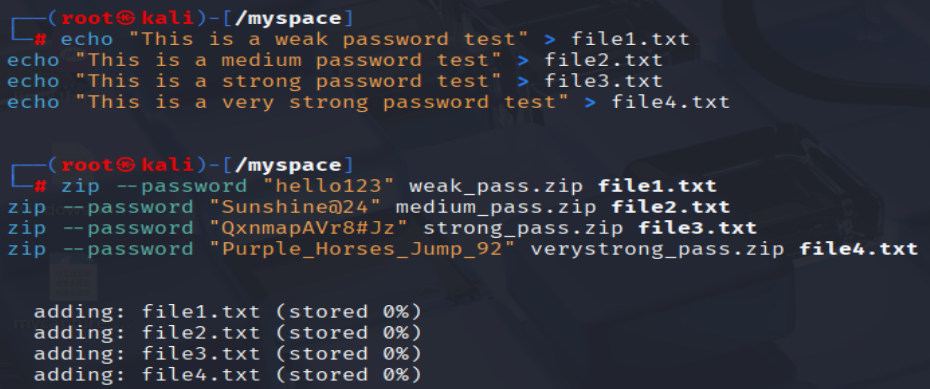
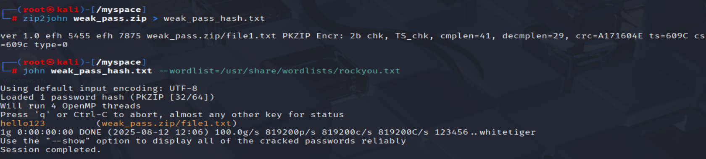

# password-strength-and-cracking

## Objective
Demonstrate password security by creating password-protected ZIP archives of varying complexity, then attempting to crack them using **John the Ripper** in Kali Linux.

---

## Tools Used
- **Kali Linux**
- **John the Ripper**
- **zip2john** utility
- **rockyou.txt** wordlist

---

## Steps Performed

### 1. Created Test Files
```bash
echo "This is a weak password test" > file1.txt
echo "This is a medium password test" > file2.txt
echo "This is a strong password test" > file3.txt
echo "This is a very strong password test" > file4.txt
````

---

### 2. Created Password-Protected ZIP Files

```bash
zip --password "hello123" weak_pass.zip file1.txt
zip --password "Sunshine@24" medium_pass.zip file2.txt
zip --password "Qx!3Vr8#Jz" strong_pass.zip file3.txt
zip --password "Purple_Horses_Jump_92!" verystrong_pass.zip file4.txt
```

---

### 3. Converted ZIP Files to Hashes

```bash
zip2john weak_pass.zip > weak_pass_hash.txt
```

---

### 4. Cracked Passwords with John the Ripper

```bash
john weak_pass_hash.txt --wordlist=/usr/share/wordlists/rockyou.txt
```

If `rockyou.txt` is compressed:

```bash
sudo gzip -d /usr/share/wordlists/rockyou.txt.gz
```

---

### 5. Automated Cracking Script

```bash
#!/bin/bash

WORDLIST="/usr/share/wordlists/rockyou.txt"

# Extract rockyou.txt if compressed
if [ -f "${WORDLIST}.gz" ]; then
    echo "[*] Extracting rockyou.txt..."
    sudo gzip -d "${WORDLIST}.gz"
fi

for zipfile in *.zip; do
    echo "[*] Processing: $zipfile"
    
    hashfile="${zipfile%.zip}_hash.txt"
    
    # Create hash from zip
    zip2john "$zipfile" > "$hashfile"
    
    # Run John on the hash
    john "$hashfile" --wordlist="$WORDLIST"
    
    # Show the cracked password
    john --show "$hashfile"
    
    echo "---------------------------------------"
done
```

Save as `crack_all_zips.sh`:

```bash
chmod +x crack_all_zips.sh
./crack_all_zips.sh
```

---

## Cracking Results

| ZIP File              | Password                 | Cracked? |
| --------------------- | ------------------------ | -------- |
| `weak_pass.zip`       | `hello123`               |  Yes    |
| `medium_pass.zip`     | `Sunshine@24`            |  No     |
| `strong_pass.zip`     | `Qx!3Vr8#Jz`             |  No     |
| `verystrong_pass.zip` | `Purple_Horses_Jump_92!` |  No     |

---

## Analysis

* **Weak password** was found instantly because it existed in `rockyou.txt`.
* **Medium password** resisted attack because it included mixed case, numbers, and special characters, and was not in the wordlist.
* **Strong and Very Strong passwords** were also not cracked — this demonstrates the importance of complexity and length.

---

## Screenshots
* 
* 
* 

---

## Conclusion

Weak passwords are easily cracked with common wordlists.
Using **long, complex, and unique passwords** significantly improves security and prevents dictionary-based attacks.

---
